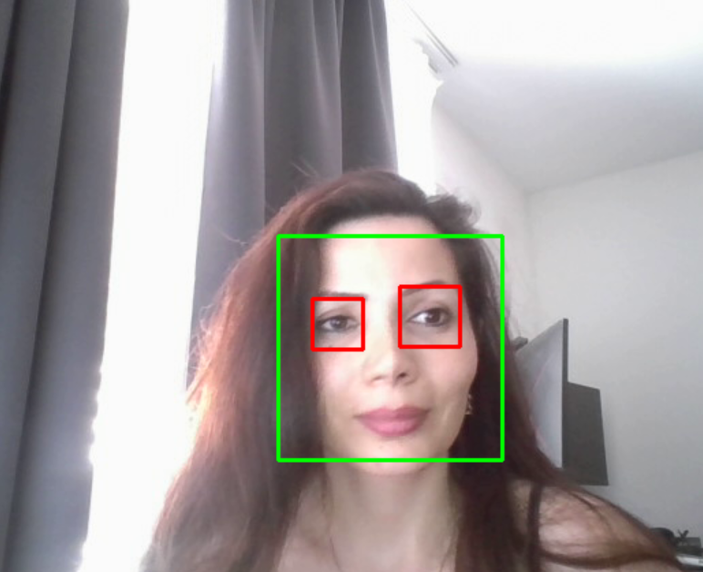

# Real‑Time Face & Eye Detection 🤖👀

> **A lightweight Python project that opens your laptop’s webcam, detects every face in real time, and then pinpoints the eyes inside each face—drawing a green rectangle around faces and a red one around eyes.**

---

## Table of Contents

1. [Features](#features)
2. [Installation](#installation)
3. [Usage](#usage)
4. [How It Works](#how-it-works)
5. [Project Structure](#project-structure)
6. [Troubleshooting](#troubleshooting)
7. [Resources](#resources)

---

## Features

* 📸 **Webcam streaming** — captures live video from your default camera.
* 💡 **Haar‑cascade models** — zero training required; uses the XML classifiers that ship with OpenCV.
* 📏 **ROI optimisation** — eyes are searched only inside detected faces for speed and fewer false positives.
* 🎨 **Color‑coded boxes** — green for faces, red for eyes.
* 🏃 **Real‑time performance** — runs at \~25–30 FPS on a typical laptop CPU.
* 🐍 **Pure Python** — one self‑contained script (`detect_face_and_eyes.py`).

---


## Installation

> **Prerequisites**
>
> * Python ≥ 3.8
> * A webcam (built‑in or USB)
>
> OpenCV’s Python wheel supplies the Haar‑cascade XML files automatically, so you *don’t* need to download anything else.

Install OpenCV and the only other dependency (`pathlib` is built‑in):

```bash
pip install opencv‑python
```


If you plan to freeze the app into an executable, add `opencv‑python‑headless` and a GUI layer like `PySide6` or `tkinter`.

---

## Usage

```bash
python detect_face_and_eyes.py [--camera 0] [--min-face 60] [--min-eye 20]
```

| Argument     | Default | Description                                            |
| ------------ | ------- | ------------------------------------------------------ |
| `--camera`   | `0`     | Index of the webcam (`1`, `2`, … for external cameras) |
| `--min-face` | `60`    | Ignore faces smaller than this size (px)               |
| `--min-eye`  | `20`    | Ignore eyes smaller than this size (px)                |

### Keyboard shortcuts

*  q  — Quit the application.


## How It Works

1. **Capture** — Read a frame from the webcam.
2. **Pre‑process** — Convert the BGR frame to grayscale (Haar cascades require grayscale input).
3. **Face detection** — `detectMultiScale` scans the image at multiple scales to find faces.
4. **Eye detection** — For each detected face, scan only its region of interest (ROI) for eyes.
5. **Annotate** — Draw colored rectangles over the original BGR frame.
6. **Display** — Show the annotated frame in a resizable window.

Here's a demo of it in action:

<p align="center">
  
</p>

---

## Project Structure

```text
object_detection/
├── assets/
│   ├── demo_frame.png        # single annotated frame (PNG)
│   └── pipeline.png          # the diagram shown above
├── detect_face_and_eyes.py   # main script
├── requirements.txt          # pinned dependency versions
└── README.md                 # you’re here 📝
```

---

## Troubleshooting

| Problem                     | Possible Cause & Fix                               |
| --------------------------- | -------------------------------------------------- |
| *No camera found*           | Wrong `--camera` index. Try `1` or `2`.            |
| *Haar cascades can’t load*  | Broken OpenCV install. Re‑install `opencv‑python`.  |
| *Lag / low FPS*             | Reduce input resolution or skip every N frames.    |
| *Many false eye detections* | Increase `--min-eye` or use a CNN eye detector.    |

---

## Resources

* 📄 Original Haar Cascade Paper (Viola-Jones): https://www.cs.cmu.edu/~efros/courses/LBMV07/Papers/viola-cvpr-01.pdf

* 📚 OpenCV Haar Cascade Tutorial: https://docs.opencv.org/4.x/db/d28/tutorial_cascade_classifier.html

---

